## Learning React

---

> এখানে React যা যা শিখবো নোট করে রাখবো

---

### Some Links:

[React Official Doc](https://react.dev/)
[Vite](https://vitejs.dev/guide/)
[React 19](https://19.react.dev/)
[React](https://react.dev/)

---

## 📝 NOTE START

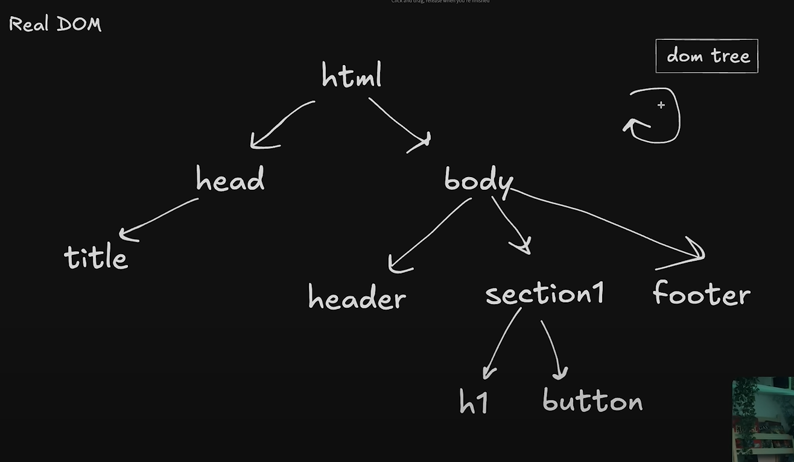
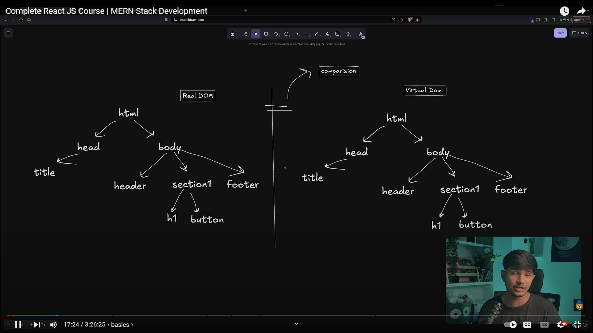

- Real Dom থেকে Vartual DOM এ একটা কপি নিয়ে রাখে এবং এর পরে পরিবর্তন প্রয়োজন হলে সেইটা সুধু `Real Dom এবং Vartual DOM` এ ক্মপেয়ার করে সেইটায় চেঞ্জ করে থাকে। সেইটাই পরিবর্তন করবে অন্যথায় Real Dom পুরোটা আবার রেন্ডার বা রিলোড নিতো।

---

✨ Learn First From Document
👉 For Web Devlopment :- React DOM
👉 For App Devlopment :- React Native
👉 npx :- node package exicuter

- What is Recat js
  - js libraray & build Front end, building UI
  - React component based Architecture :- একটা ওয়েব পেজে তেরির জন্য ছোট ছোট অনেক কম্পোনেন্ট থাকে, এবং সেই কম্পোনেন্ট গুলো একত্রে একটি ওয়েব সাইট বানানো হয়।
  - Use for Complex Front end

---

## 📝 React Learning Process

- Indepth
  - bable, fibre, virtual dom . diff algorithm, hydration, tree shaking
- by making Projects
  - todo, calculator, github api

#### ✨ React Topic

- Core react [State or UI manipulation, JSX]
- Component Reusability
- Props
- How to propagate Changes [Hooks -> useState, useEffects]

- SPA => single page Application

##### ✨ Learn MORE

- -> Router [React Router DOM]
- -> State Management [Redax , Redux ToolKit, Zustand, Context API]
- -> ❌ Class Based Component
- -> BAAS APPS [Backend App as service]
  - -> Social Media Clone, Ecpmmerce APP
    - -> appwrite / firebase / superbase

##### ✨ After React

- ✨ Backend - Framwork
  - ✨ Next Js / Gatsby / Remix

---

## ✨ React Install Process

- File Path এর মধ্যে কোন & থাকলে ফাইল রান করবে না।

* 1️⃣ Terminal -> npx create-react-app "FileName" ❌!Recomended
* 2️⃣ Install With Vite

  - 2️⃣ Vite is asset Bundling & give
  - 2️⃣ Modules with depenencies -> Static Assets

  - npm create vite@latest
  - y
  - FOlder Name
  - React
  - JavaScript
  - Done Install React
  - cd "folderName"
  - এখানে node_module আসেনা তাই ইন্সটল করতে হবে - 👉 > npm i - npm install -g vite [SomeTimeNeed]

    - ### Run Project using Vite
    - 👉 > npm run dev
    - OR
    - 👉 > vite-project@0.0.0 dev
    - 👉 > vite
    - 👉 > vite dev

    - ### Add build[dist] folder
    - 👉 > npm run build
    - 👉 > npx vite build

      ### 🫧 Clean File

          - Recomend Edit Readme FIle
          - Most Of Time Using src
          - Delete assets file
          - only Have -> app.jsx & main.jsx

      ### 📁 GEt STRAT TO CREATE PROJECT

          - remove index.css & import index.css from main.jsx
          - remove app.css
          - assets -> remove svg icon

          📁src
            - pages
            - Components
            - assets
              - images
              - css - FOlder
            - app.jsx
            - main.jsx

          📁Public
            -

```js
//app.jsx
function App() {
  return <h1>Hello React Test</h1>;
}
export default App;
```

```js
//main.jsx
import { StrictMode } from "react";
import { createRoot } from "react-dom/client";
import App from "./App.jsx";

createRoot(document.getElementById("root")).render(
  <StrictMode>
    <App />
  </StrictMode>
);
```

---

- Public -> Index.html
  - spa => Single Page Application

## 📂 Project Structure

- ✨ Distribution -> Dist
- ✨ Node Modules
- ✨ public
- ✨ Source
- ✨ Package.json
- ✨ vite Config

---

> ### ✨ vite Config
>
> - auto genated Files
> - Update Config If need

<br>

> ### ✨ Package.json
>
> - এই ফাইলটা হচ্ছে কি কি Package ইন্সটল আছে, প্রোজেক্ট এর ডিটেইলস এইগুলো এই ফাইলে থাকে
> - dependencies এর মধ্যে যা আছে এইগুলো প্রডাক্টশন এ যাবে
> - devdependencies এর মধ্যে যা আছে এইগুলো final প্রডাক্টশন এ যাবে না এইগুলো ডেভ্লপমেন্ট এ কাজ করে সুধু।
> - npm i packageName দিয়ে যেই মডিউল গুলো ডাউনলোড করা হয় সেইটা এইখানে থাকে।

<br>

> ### ✨ index.html
>
> - spa => Single Page Application
> - html file একটাই থাকবে
> - <div id="root"></div> এইটার মধ্যে সব ফাইল গুলো থাকে

<br>

> ### ✨ .gitignore
>
> - কোন কোন ফাইল github এ pull push হবে না সেইগুলো এইখানে থাকে

<br>

> ### ✨✨ source -> src\*\*\*
>
> - এর মধ্যে কাজ করবো
> - main.jsx
>   - এইফাইলে সব ফাইল import করে রাখা থাকবে।
> - main.jsx -> app.jsx
>   - এইফাইলে মধ্যে main action গুলো নিবে।

<br>

> ### ✨ node Module
>
> - এর মধ্যে সব Module থাকবে
> - npm i দিলে Package.json এ থাকে মডিউল/ Dependency গুলো এইখানে চলে আসবে।

<br>

> ### ✨ dist = Build
>
> - npm run build
> - npx vite build
> - dist -> assets এর মধ্যে

---

---

## ✨ Components

- বার বার ব্যবহার করা যায়
- Component তেরির সময় প্রথম অক্ষর বড় হারে হবে।

## Functional Components

## 

- view output Return করে।

```jsx
const App = () => {
  return <div></div>;
};

export default App;
```

- vs code -> `rsc` to create this
- App এর করান আমরা app.jsx ফাইলে কাজ করছি`- যে ফাইলে কাজ করছি সেইফাইলের নাম দিয়ে ফাংশন বানাতে হবে।
- **return এর মধ্যে যা আছে এইগুলোকে বলে রেন্ডারিং**
- Server Side Rendaring - server computer / server | CSI
- Client Side Rendaring - Browser Rendaring

#### Component app.jsx এর মধ্যে এড করা নিয়ম।

- Craete a jsx file in Component folder
- import This jsx file in app.jsx

```jsx
// Demo.jsx
const Demo = () => {
  return (
    <div>
      <h1>Im DEMO Functional Component</h1>
    </div>
  );
};

export default Demo;
```

```jsx
// app.jsx
import Demo from "./demo";

const App = () => {
  return (
    <div>
      <Demo />
    </div>
  );
};
```

```jsx
// app.jsx
import Footer from "./components/Footer";
import Header from "./components/Header";
import Hero from "./components/Hero";
import From from "./components/From";

const App = () => {
  return (
    <div>
      <Header />
      <Hero />
      <From />
      <Footer />
    </div>
  );
};
```

## 📖 Learn jsx

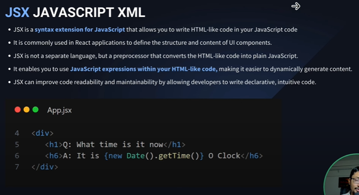

- jsx & Html looks same but have some diffrests in syntext
- jsx => jsx javascript XML
- HTML কোড এলাউ করে javascript কোডে
- JSX ফাইলের মধ্যে HTML কোড এর মধ্যে javascript কোড লেখা যায় `<h1>{2+2}</h1>`
- `import {jsx as _jsx} from "react/jsx-runtime.js"` এভাবে main.js দিয়ে কাজ করা যায়, কিন্তু কঠিন।
- LEarn More Github Repo [JSX](https://github.com/facebook/react/tree/main/packages/react/src/jsx): react/packages/react/src
  /jsx

#### JSX Conventions

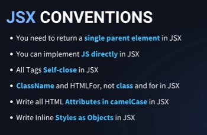

##### ✨ Return Single Parent element in jsx

- প্রথমে Opening এন্ড Closing টেগ থাকবে যেমনঃ

  - `<div></div>`
  - `<>  </>`
  - `import {Fragment } from "react"`
  - `<Fragment></Fragment>`

```jsx
import { Fragment } from "react";

function App() {
  return (

    <div>
      <h1>Hello</h1>
      <h1>{2 + 2}</h1>
    </div>

    <>
      <h1>Hello World</h1>
    </>

    <Fragment>
      <h1>Hello World</h1>
    </Fragment>
  );
}

export default App;
```

##### ✨ Emplement Javascript Directly in jsx

- jsx এর মধ্যে javascript লেখা যায়
- `<h1>{2+2}</h1>`
- {ব্রেকেট} দিয়ে ব্লক এর মধ্যে লিখেতে হবে

```js
import { Fragment } from "react";

function App() {
  return (
    <Fragment>
      <h1>Hello World</h1>
      <h2>{new Date().getHours()}</h2>
      <h2>{new Date().getMinutes()}</h2>
    </Fragment>
  );
}

export default App;
```

##### ✨ need to close all tag - self Close in jsx

- ``
- `<p />`
- `<h1 />`

##### ✨ Jsx className

- jsx এ ক্লাস নিতে গেলে লিখতে হবে className="heading"

```jsx
function App() {
  return (
    <div>
      <h1 className="heading">Hello In Css Class</h1>
    </div>
  );
}

export default App;
```

##### ✨ all HTML attributes in camelCase in Jsx

- Jsx এর attributes গুলো কেমেল্কেস হবে।

```jsx
function App() {
  return (
    <div>
      <button onClick={() => alert("Hello")}>Submit</button>
      <button onSubmit="">Submit</button>
    </div>
  );
}

export default App;
```

##### ✨ inline css Styles in objects

- style={{style in object}}
- style={{ color: "red",fontSize: "36px",}}

```jsx
function App() {
  return (
    <div>
      <button style={{ color: "red", fontSize: "36px" }}>SUbmit</button>
    </div>
  );
}

export default App;
```

---

## Jsx

##### ✨ Create Variable

```jsx
function App() {
  const userName = "Shanto";

  return <h1>Hello WOrld {userName}</h1>;
}

export default App;
```

- {} এইখানে Js Code লেখা যায়না।
- এইখানে Evalated Expreation লেখা হয়।
- এইখানে সুধু Completion / Outputs দেখায়

##### ✨ Create Variable Behind The Seacn in main.jsx

```jsx
import React from "react";
import { createRoot } from "react-dom/client";
import App from "./App.jsx";

const userNameVariable = " ! Shanto";
const reactElement = React.createElement(
  "a",
  { href: "GOOGLE.com", target: "_blank" },
  "HELLO WORLD From React Element",
  userNameVariable
);

createRoot(document.getElementById("root")).render(reactElement);
```

- Behind the scen এ reactElement এর মধ্যে html এলিমেন্ট এর পরে ভেরিএবল ব্যবহার হয় আব্জেক্ট আকারে।
- এইখানে অব্জেক্ট এর মধ্যে if else or loops ব্যবহার করা যায় না।

## Jsx Ternary Operator

##### ✨ Inline if else

```jsx
function App() {
  let marks = 80;
  return (
    <div>
      {marks > 80 ? <h1>Brilliant Result</h1> : <h1>Avarage Result</h1>}
    </div>
  );
}

export default App;
```

##### ✨ jsx immediately-invoked

- immediately-invoked function Create করার সাথে সাথে কল করা যায়।

```jsx
  <div>
  {(
    ()=>{
      return `text`;
    }
  ),()}
  </div>

  -----------------
import Condition from "./moreLearn/Condition";
import IIFF from "./moreLearn/IIFF";

function App() {
  return (
    <div>
      <Condition />
      <IIFF />
    </div>
  );
}

export default App;


  const IIFF = () => {
  let marks = 90;
  return (
    <div>
      {(() => {
        if (marks > 80 && marks < 100) {
          return <h1>You get A+</h1>;
        }
      })()}
    </div>
  );
};
```

---

### Jsx Loop

- Map Use হয়ে থাকে।

```jsx
const Loop = () => {
  const city = ["Dhaka", "New York", "Dilhi"];
  return (
    <div>
      <h1>Loop In Js</h1>
      <ul>
        {city.map((item, i) => {
          return <li key={i.toString()}>{item}</li>;
        })}
      </ul>
    </div>
  );
};

export default Loop;
```


- Return করার ক্ষমতা রাখে।
- [MORE LOOPS](https://www.telerik.com/blogs/beginners-guide-loops-in-react-jsx)

---

### Jsx Conditional Rendering

- Case: ইউজার যখন Login Button এ ক্লিক করবে তখন তাকে logout বাটন সো করাতে হবে এইটা হচ্ছে Conditional Rendering
- if... else
- Switch
- Ternary Operator
- Logical &&
- IIFF

##### ✨ If ... Else Condition

```jsx
const logInStatus = (status) => {
  if (status) {
    return <button>Logout Button</button>;
  } else {
    return <button>Login Button</button>;
  }
};

const Conditional_randaring = () => {
  return (
    <div>
      <h1>Login Status</h1>
      {logInStatus(false)}
    </div>
  );
};

export default Conditional_randaring;
```

##### ✨ Switch Case Statement

```jsx
const Conditional_randaring = () => {
  const status = false;

  switch (status) {
    case true:
      return (
        <>
          <h1>Login Status</h1>
          <button>Logout</button>
        </>
      );
    case false:
      return (
        <>
          <h1>Login Status</h1>
          <button>Login</button>
        </>
      );
    default:
      return null;
  }
};

export default Conditional_randaring;
```

##### ✨ Ternary Operation

```jsx
const Conditional_randaring = () => {
  let status = false;

  return (
    <div>
      <h1>Login Status</h1>
      {status ? <button>Logout</button> : <button>Login</button>}
    </div>
  );
};

export default Conditional_randaring;
```

##### ✨ && || Operation

```jsx
const Conditional_randaring = () => {
  let status = false;

  return (
    <div>
      <h1>Login Status</h1>
      {(status && <button>Logout</button>) || <button>Login</button>}
    </div>
  );
};

export default Conditional_randaring;
```

## ✨ Props -> Properties


- Reuse Componets ->
- এক Component এর ভ্যেলু অন্য Component এ পাঠাতে সাহাজ্য করে।
- এইখানে পেরেন্ট এর চাইল্ড এর ফ্লো ধরে কাজ করেতে হবে।
- যেমনঃ app.jsx হচ্ছে Parent, Hero.jsx হচ্ছে app.jsx চাইল্ড, এবং HeroImg.jsx যদি Hero.jsx এ ইম্পোর্ট করা হয় তাহলে সেইটা হচ্ছে Hero.jsx এর চাইল্ড এভাবে Uni-direction flow তে চলে।
- Props data is Read Only / Emutable -> এর মানে, পেরেন্ট Component এর ডাটা চাইল্ড ডাটা দিয়ে পরিবর্তন হবে না।- পেরেন্ট এর ডাটা চাইল্ড চেঞ্জ করতে পারবেনা,পেরেন্ট Component যেভাবে ডাটা পাঠাবে সেইভাবে চাইল্ড কে ডাটা রিসিভ করতে হবে।

#### কিভাবে কাজ করে তার ব্রকেথ্রু।

- Props Handelending -> function Card(props)
- Props Handelending -> function Card({objectKey,objectKey="diff Value"})

#### Project Card

```jsx
✨ app.jsx

import React from "react";
import Card from "./components/Card";

const App = () => {
  let myObj = [
    {
      imgURL:
        "https://images.pexels.com/photos/9069035/pexels-photo-9069035.jpeg?auto=compress&cs=tinysrgb&w=1260&h=750&dpr=1",
      name: "DevXShanto",
      designation: "UiUX Designer",
      pera: "Lorem ipsum dolor sit, amet consectetur adipisicing elit. Corrupti laborum ut est minus nostrum",
      btnText: "Learn More",
    },
    {
      imgURL:
        "https://images.pexels.com/photos/10583179/pexels-photo-10583179.jpeg?auto=compress&cs=tinysrgb&w=1260&h=750&dpr=1",
      name: "DevXShanto",
      designation: "UiUX Designer",
      pera: "Lorem ipsum dolor sit, amet consectetur adipisicing elit. Corrupti laborum ut est minus nostrum",
      btnText: "Learn More",
    },
    {
      imgURL:
        "https://images.pexels.com/photos/28268121/pexels-photo-28268121/free-photo-of-an-old-black-and-white-photo-of-the-ruins.jpeg?auto=compress&cs=tinysrgb&w=1260&h=750&dpr=1",
      name: "DevXShanto",
      designation: "UiUX Designer",
      pera: "Lorem ipsum dolor sit, amet consectetur adipisicing elit. Corrupti laborum ut est minus nostrum",
      btnText: "Learn More",
    },
  ];
  return (
    <div className="h-lvh">
      <h1 className="bg-emerald-700 w-100 text-center block text-white font-bold p-4 rounded-full">
        React Props With Tailwind
      </h1>
      <div className="flex ">
        {myObj.map((item, index) => (
          <Card data={item} key={index} />
        ))}
      </div>
    </div>
  );
};

export default App;
```

```jsx
✨ Card.jsx
import React from "react";

const Card = ({ data }) => {
  return (
    <div className="">
      <div className="card m-5 bg-gray-100 p-4 rounded text-gray-700">
        
        <div className="des my-3">
          <h2 className="font-bold text-3xl capitalize">{data.name}</h2>
          <p className="font-medium text-xl">{data.designation}</p>
        </div>
        <p>{data.pera}</p>
        <button className="bg-emerald-800 px-4 py-3 rounded-xl mt-4 text-white">
          {data.btnText}
        </button>
      </div>
    </div>
  );
};

export default Card;
```

---

```jsx

✨ app.jsx -- Parent ⬇️

import Hero from "./Components/Hero";

function App() {
  return (
    <div>
      <Hero />
    </div>
  );
}

export default App;

✨  -- app.jsx -- Parent ➡️ Hero.jsx Child ⬇️

import HeroImages from "./HeroImages";

const Hero = () => {
  return (
    <div>
      <h1>Hello Hero Section</h1>
      <HeroImages />
    </div>
  );
};

export default Hero;


✨ Hero.jsx Parent ➡️ HeroImages.jsx Child

const HeroImages = () => {
  return (
    <div>
      
    </div>
  );
};

export default HeroImages;


```

### ✨ Props String pass

```jsx
📁 App.jsx
import Hero from "./Components/Hero";

function App() {
  return (
    <div>
      {/* Learning Props */}
      <Hero title="This is React" Des="Learning React jsx Props" />
    </div>
  );
}

export default App;
```

```jsx

📁 Hero.jsx
const Hero = (props) => {
  return (
    <div>
      <h1>{props.title}</h1>
      <h1>{props.Des}</h1>
    </div>
  );
};

export default Hero;
```

- এখানে 📁 App.jsx হচ্ছে Parent এবং 📁 Hero.jsx হচ্ছে এর চাইল্ড।
- এখানে App.jsx থেকে স্ট্রিং ডাটা Hero.jsx পাঠানো হচ্ছে। এইডাটা সুধু পেরেন্ট ক্মপোনেন্ট পরিবর্তন করতে পারবে, চাইল্ড কোন পরিবরন করতে পারবেনা।

### ✨ Props Object pass

```jsx
📁 App.jsx
import Hero from "./Components/Hero";

function App() {

  const itemObj = {
    name: "Saiful Islam Shanto",
    learning: "React JSx",
    city: "Narayanganj",
  };

  return (
    <div>
      <Hero item={itemObj} />
    </div>
  );
}

export default App;

```

```jsx

📁 Hero.jsx
const Hero = (props) => {
  return (
    <div>
      <h3>Name : {props.item["name"]}</h3>
      <h3>Learning : {props.item["learning"]}</h3>
      <h3>City : {props.item["city"]}</h3>
    </div>
  );
};

export default Hero;

```

### ✨ Props Function Pass

```jsx
📁 App.jsx - Component Load এর সাথে সাথে এক্সিকিউট হয়ে যাবে
import Hero from "./Components/Hero";

function App() {
  return (
    <div>
   <button onClick={alert("Hello World")}>Click</button>
    </div>
  );
}

export default App;

```

```jsx
📁 App.jsx - arrow function inside the randaring
import Hero from "./Components/Hero";

function App() {
  return (
    <div>
   <button
        onClick={() => {
          alert("Hello World Inside With Arrow Function");
        }}
      >
        Click - Inside Button - AF
      </button>
    </div>
  );
}

export default App;

```

```jsx
📁 App.jsx - Regular function inside the randaring
import Hero from "./Components/Hero";

function App() {
  return (
    <div>
   <button
        onClick={function demo() {
          alert("Hello World Inside With Regular Function");
        }}
      >
        Click - Inside Button - RF
      </button>
    </div>
  );
}

export default App;

```

```jsx
📁 App.jsx - Regular function Outside the randaring
import Hero from "./Components/Hero";

  function showAlert() {
    alert(" HEllo World Reguler function");
  }


function App() {
  return (
    <div>
   <button onClick={showAlert}>Click</button> <br />
    </div>
  );
}

export default App;

```

```jsx
📁 App.jsx - Arrow function Outside the randaring

import Hero from "./Components/Hero";
  const showAlert2 = () => {
    alert(" HEllo World with arrow function");
  };

function App() {
  return (
    <div>
   <button onClick={showAlert2}>Click</button> <br />
    </div>
  );
}

export default App;
```

## Form Submit in jsx ✨

- একটা ফ্রোম সাবমিট এর সময় রিলোড নেয়, কিন্তু এইটা বন্ধ করতে চাইলে form এর form এ ফাংশন পাস করতে হবে।
- preventDefault -> ডিফল্ট বিহেবিয়ার ইভেন্টকে বন্ধ করে দেয়।

```jsx
📁 App.jsx

import Hero from "./Components/Hero";
  const postFromData = (event) => {
    event.preventDefault();
    alert("Form Submitted");
  };

function App() {
  return (
      <div>
        <form action="#" onSubmit={postFromData}>
          <input type="text" placeholder="Name" />
          <button type="submit">submit</button>
        </form>
      </div>
  );
}
```

## ✨ React Hook

## 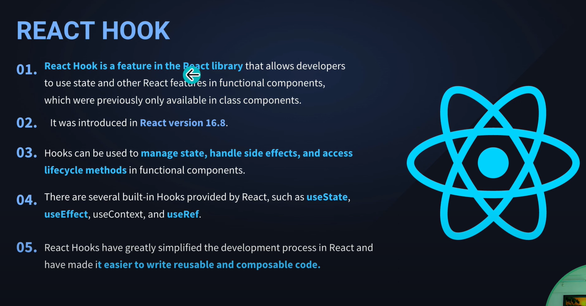

- React Hook হচ্ছে, React লাইব্রেরি এর মধ্যে React hook একটি builtIn ফিচার
- React hook এর মধ্যে অনেক গুলো মেথড আছে
- Special Type Of Functions
- UI Update করে থাকে React
- https://github.com/facebook/react/blob/main/packages/react/src/ReactHooks.js

### 1️⃣ useRef()

- Render ছাড়া কোন ভ্যেলু চেঞ্জ করা যায়
- DOM এলিমেন্ট এ এক্সেস করা যায়।

#### How to use useRef()

- useRef ব্যবহার এর জন্য প্রথমে
  - `import { useRef } from "react";` করতে হবে
- id এর বদলে, ref ব্যবহার করতে হবে
  - `<h1 ref={headingIs}></h1>` inside Return

#### change InnerHtml & InnerText

##### ✨ With Current Statemnt

```jsx
📂 main file is UseRef.jsx & import this in app.jsx

import { useRef } from "react";
const UseRef = () => {
  let headingIs = useRef();
  const change = () => {
    headingIs.current.innerHTML = "<ul><li>A</li><li>B</li></ul>";
  };
  return (
    <div>
      <h2>Learn Useref</h2>
      <h1 ref={headingIs}></h1>
      <button onClick={change}> click </button>
    </div>
  );
};

export default UseRef;
```

##### ✨ Without Current Statemnt

```jsx

📂 main file is UseRef.jsx & import this in app.jsx

import { useRef } from "react";
const UseRef = () => {
  let headingIs = useRef();
  const change = () => {
    // * Without Current Statemnt
    headingIs.innerText = "Hello useRef without Current Statement";
  };
  return (
    <div>
      <h2>Learn Useref</h2>
      <h1 ref={(h1) => (headingIs = h1)}></h1>
      <button onClick={change}> click </button>
    </div>
  );
};

export default UseRef;
```

#### Use Attribute

```jsx

📂 main file is UseRef.jsx & import this in app.jsx

import { useRef } from "react";
const UseRef = () => {
  {
    /* ✨ Change Attribute Value  */
  }
  let myImg = useRef();
  const showImg = () => {
    myImg.current.src = "https://placehold.co/600x400?text=Hello+World";
    myImg.current.setAttribute("height", "200px");
    myImg.current.setAttribute("width", "300px");
  };

  return (
    <div>
      <h2>Learn Useref</h2>

      {/* ✨ Change Attribute Value  */}

      
      <button onClick={showImg}>Click</button>
    </div>
  );
};

export default UseRef;
```

#### Use In Input

```jsx
import { useRef } from "react";
const UseRef = () => {
  // For Multipale Refferance
  let firstName,
    lastName,
    Age = useRef();

  const showName = () => {
    let FName = firstName.value;
    let lName = lastName.value;
    let age = Age.value;

    alert(`First Name : ${FName} \nLast Name : ${lName} \nAge : ${age}`);
  };

  return (
    <div>
      <h2>Learn Useref</h2>
      {/* ✨ Input  */}

      <input
        ref={(a) => (firstName = a)}
        type="text"
        placeholder="First Name"
      />
      <br />
      <input ref={(b) => (lastName = b)} type="text" placeholder="Last Name" />
      <br />
      <input ref={(ageIs) => (Age = ageIs)} type="text" placeholder="Age" />
      <br />
      <button onClick={showName}>Show Name</button>
    </div>
  );
};

export default UseRef;
```

```jsx
import { useRef } from "react";
const UseRef = () => {
  {
    /* ✨ Input  */
  }
  let firstName = useRef();
  let lastName = useRef();

  const showName = () => {
    let FName = firstName.current.value;
    let lName = lastName.current.value;

    alert(`${FName} ${lName}`);
  };

  return (
    <div>
      <h2>Learn Useref</h2>

      {/* ✨ Input  */}

      <input ref={firstName} type="text" placeholder="First Name" />
      <br />
      <input ref={lastName} type="text" placeholder="Last Name" />
      <br />
    </div>
  );
};

export default UseRef;
```

#### Add & Remove - Css Class

##### ✨ Install Bootstrap In React Projects

- npm i bootstrap@5.3.3
- `import "bootstrap";`
- `import "bootstrap/dist/css/bootstrap.min.css";`
- 🚀 Lets GOOOOOOOOOOOOO

```jsx
import { useRef } from "react";
const UseRef = () => {
  let myGeadLine = useRef();
  {
    /*Change Singel Class*/
  }
  const change = () => {
    myGeadLine.current.classList.remove("text-success");
    myGeadLine.current.classList.add("text-primary");
  };

  {
    /*Change Multiple Class*/
  }
  let myHeading = useRef();
  const changeBTN = () => {
    myHeading.current.classList.remove("text-white", "bg-dark", "text-center");
    myHeading.current.classList.add("text-danger", "bg-primary", "text-left");
  };

  return (
    <div>
      <h2>Learn Useref</h2>

      {/* ✨ Css Class  */}
      <div>
        {/*Change Singel Class*/}
        <h1 className="text-success" ref={myGeadLine}>
          This is Head Line
        </h1>
        <button onClick={change}>Change Color</button>

        {/*Change Multiple Class*/}
        <h1
          className="text-white p-2 fs-5 text-center mx-4 bg-dark"
          ref={myHeading}
        >
          Hello World, Css Class add
        </h1>
        <button onClick={changeBTN}>change</button>
      </div>
    </div>
  );
};

export default UseRef;
```

#### Persisted Mutable Values

- Component এর ভিতরে কোন ভ্যেলু চেঞ্জ করলে Component ফাইল রিরেন্ডার হবেনা। রিরেন্ডার ছাড়া একটা ভ্যেলুকে চেঞ্জ করা হয় useRef() দিয়ে।

```jsx
import { useRef } from "react";
const UseRef = () => {
  let number = useRef(0);
  const change = () => {
    number.current++;
    console.log(number.current);
  };

  return (
    <div>
      <h2>Learn Useref</h2>
      <button onClick={change}>Increment</button>
    </div>
  );
};

export default UseRef;
```

#### UseRef Caching Expensive Computation

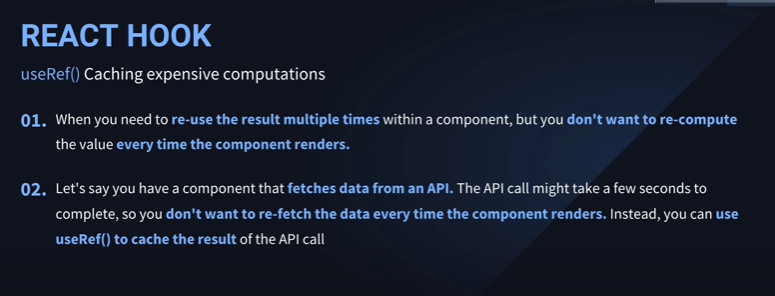

- API Calling :-

```jsx
import { useRef } from "react";
const UseRef = () => {
  const storeAPI = useRef(null);
  // - এখানে storeAPI এর মধ্যে API কল হয়ে সেইটা জমা হয়ে থাকবে এবং পরে কল করলে আর সাইটে গিয়ে কল হবে না জমা ডাটা থেকে ডাটা প্রদান করবে
  const showData = useRef();
  // - showData এর মধ্যে ডাটা দেখাবে

  const callAPI = async () => {
    // const response = await fetch("https://dummyjson.com/products");
    const response = await fetch("https://jsonplaceholder.typicode.com/users");
    // - API কল করা হইছে।
    storeAPI.current = await response.json();
    // - API এর ডাটা storeAPI তে জমা করা হইছে।
  };
  const showAPIdata = () => {
    showData.current.innerText = JSON.stringify(storeAPI.current);
    - showData এর মধ্যে API এর ডাটা storeAPI থেকে JSON.stringify এ কনভার্ট করে রাখা হইছে বাটনে।
  };

  return (
    <div>

      // --> API ডাটা দেখাবে ডিসপ্লেতে।
      <p ref={showData}></p>
      // --> API Call করবে
      <button onClick={callAPI}>API CALLING</button>
      // --> API এর কল করা ডাটা p এর মধ্যেমে দেখাবে
      <button onClick={showAPIdata}>Show API Data</button>
    </div>
  );
};

export default UseRef;
```

## 2️⃣ useState()

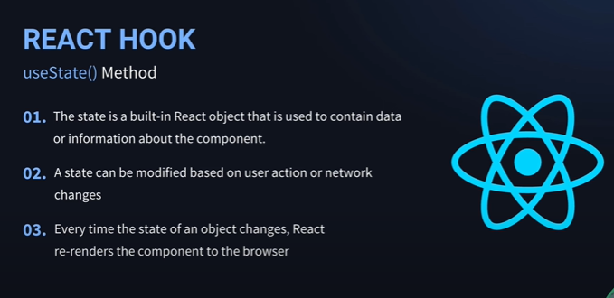
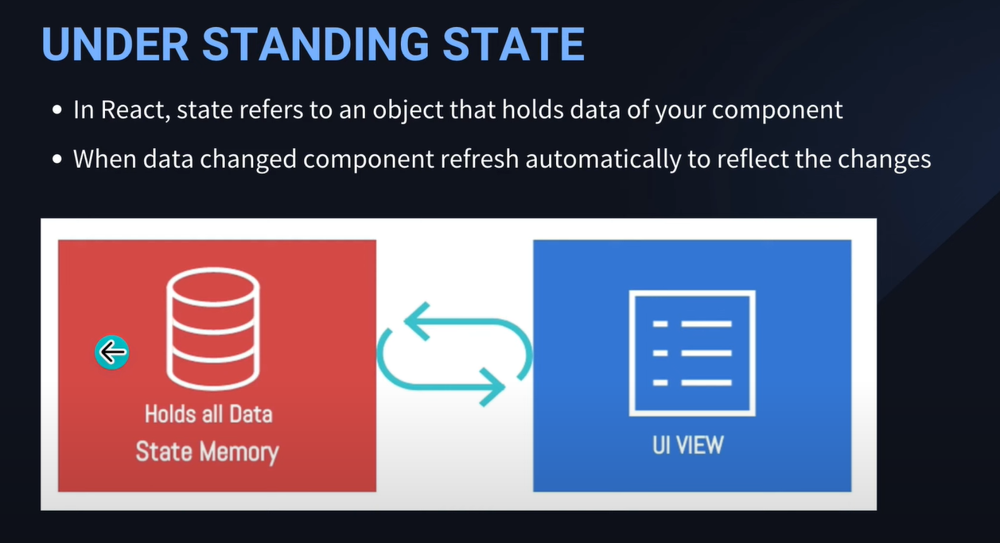

- 📦State Memeory 🔁 UI VIEW 🪟
- UI এর ডাটা গুলো 📦State এ জমা থাকে এখন যদি `UI` এর ডাটা পরিবর্তন করা হয় থালে সেইগুলো 📦`State` এ জমা থাকবে এবং যদি `📦State` এর ডাটে চেঞ্জ হয় তাহলে সেইগুলো `UI VIEW` তে চেঞ্জ হয়ে যাবে।

- State এর মধ্যে যদি কোন ডাটা বা ভ্যেলু চেঞ্জ করা হয় তাহলে সেইটা UI তে আটোমেটিকেলি চেঞ্জ হবে কোন লোড বা রেন্ডার না করে।

- State এর মধ্যে যে ডেটা থাকে সেইগুলো থাকে জাভাস্ক্রিপ্ট অব্জেক্ট আকারে থাকে

```jsx
import { useState } from "react";

const UseStateIs = () => {
  let [numberIs, setNumber] = useState(0);

  const change = () => {
    setNumber(numberIs + 1);
  };

  return (
    <>
      <h1>Learnning UseState()</h1>
      <div>
        <h1>Nubmer : {numberIs} </h1>
        <button onClick={change}>Click</button>
      </div>
    </>
  );
};

export default UseStateIs;
```

```jsx
import { useState } from "react";

const UseStateIs = () => {
  {
    /* ✨ Usestate() */
  }
  let [number, setNumber] = useState(0);

  return (
    <>
      <h1>Learnning UseState()</h1>
      <div>
        <h1>Number : {number}</h1>
        <button onClick={() => setNumber(number + 1)}>click</button>
      </div>
    </>
  );
};

export default UseStateIs;
```

#### ✨ WOrk with object in useState()

```jsx
// 🗨️ Set & Update Indiviaual Object

import { useState } from "react";

const UseStateIs = () => {
  // {/* ✨ Usestate() */}
  // {/* ✨ Usestate pass object */}
  const [myObj, setMyObj] = useState({
    key1: "value 1",
    key2: "value 2",
    key3: "value 3",
  });

  // => Set Multiple Object Value
  const change = () => {
    setMyObj((pervOBJ) => ({
      ...pervOBJ,
      key1: " NEW VALUE OF KEY 1",
      key2: " NEW VALUE OF KEY 2",
      key3: " NEW VALUE OF KEY 3",
    }));
  };

  return (
    <>
      <h1>Learnning UseState()</h1>
      <div>
        <h1>{myObj.key1}</h1>
        <button onClick={change}>Change</button>
      </div>
    </>
  );
};

export default UseStateIs;
```

```jsx
// 🗨️ Set & Update All Object
import { useState } from "react";

const UseStateIs = () => {
  // {/* ✨ Usestate() */}
  // {/* ✨ Usestate pass object */}
  const [myObj, setMyObj] = useState({
    key1: "value 1",
    key2: "value 2",
    key3: "value 3",
  });

  // => Set Multiple Object Value
  const change = () => {
    setMyObj({
      key1: "Update value 1",
      key2: "Update value 2",
      key3: "Update value 3",
    });
  };

  return (
    <>
      <h1>Learnning UseState()</h1>
      <div>
        <h1>{myObj.key1}</h1>
        <button onClick={change}>Change</button>
      </div>
    </>
  );
};

export default UseStateIs;
```

#### ✨use useState for Two way Binding

- two way binding হচ্ছে, form handaling এর কাজ এবং form get data via react এর কাজ একসাথে করবে।

```jsx

import React, { useState } from "react";

const PracticeTwoWayBinding = () => {
  💭 এইখানে ভেরিএবল তেরি করা হয়েছে
  const [userName, SetUserName] = useState("");

💭 এইখানে ফরম হেন্ডেলিং করা হয়েছে
  const formHendaling = (e) => {
    💭 এইখানে ফরম হেন্ডেলিং করা হয়েছে যাতে সাবমিট দিলে রিলোড না নেয়, সে জন্য ডিফ্লট বিহেভিয়র চেঞ্জ করা হয়েছে।
    e.preventDefault();
    💭 এইখানে userName প্রিন্ট করবে
    console.log(userName);
    💭 এইখানে userName প্রিন্ট করবে এবং SetUserName ইনপুরট খালি করে দিবে।
    SetUserName("");
  };
  return (
    <div>
      <div>
        <form className="m-5"
          // 💭 এইখানে ফরম হেন্ডেলিং করা হয়েছে যাতে সাবমিট দিলে রিলোড না নেয়।
          onSubmit={(e) => {
            formHendaling(e);
          }}>
          <p>Two Way Binding From Hendaling</p>
          <input
           // 💭 এইখানে value তে userName দেওয়া হয়েছে যেই ডাটা দেখায়।
            value={userName}
            onChange={(e) => {
              // 💭 এইখানে SetUserName এর মধ্যে ভ্যেলু যেইটা টাইপ করা হইছে সেইটা দেখাবে।
              SetUserName(e.target.value);
            }}
            type="text"
            placeholder="Name"
            className="bg-slate-100 p-4  rounded border-2 border-solid border-indigo-500"
          />
          <br />
          <button className="bg-slate-600 text-white rounded p-4 mt-2">
            Submit
          </button>
        </form>
      </div>
    </div>
  );
};

export default PracticeTwoWayBinding;

```

---

#### ✨why use Spread Operator

![[34_Video]](image-11.png)

## 3️⃣ useEffect()

- useEffect() Method
  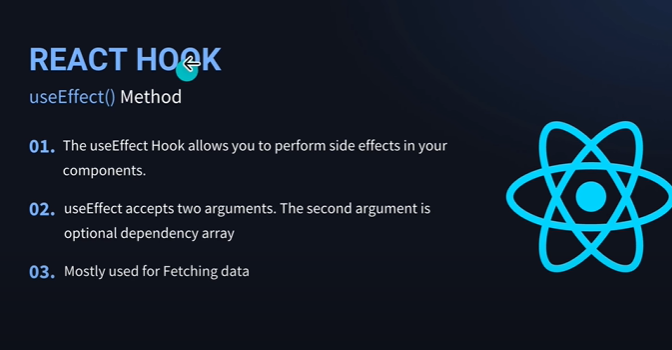

- useEffect() Method হচ্ছে যখন আমাদের রিয়েক্ট ক্মপোনেন্ট প্রথম লোড হয় তখন আটোমেটিক useEffect মেথড এক্সিকিউট হয়।
- main.jsx এ StrictMode Enable থাকলে Component দুইবার রেন্ডার রে এবং useEffect()এর ডাটা দুইবার দেখা যায়
- main.jsx এ StrictMode Remove করলে useEffect() রেন্ডার একবার হবে।

```jsx
useEffect(() => {
  console.log("হেলো রিয়েক্ট");
}, [0, 1, 2, 3, 4]);
```

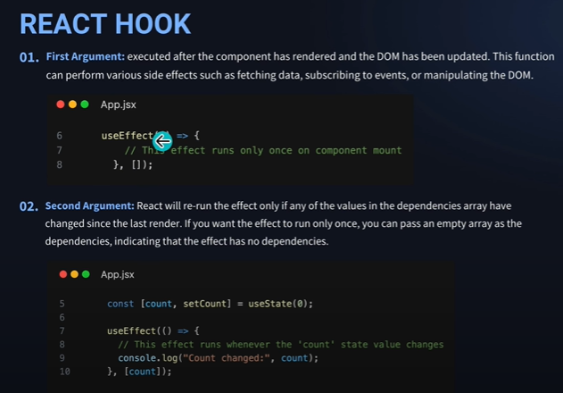

- useEffect এর দুইটা আর্গুমেন্ট থাকে।
  - 1. CallBack ফাংশন
  - 2. dependency Array -> Optional

#### ✨ Feach API

```jsx
import { useEffect, useState } from "react";

const UseEffect = () => {
  let [data, seTData] = useState();
  useEffect(() => {
    fetch("https://dummyjson.com/products/1")
      .then((res) => res.json())
      .then((json) => seTData(json));
  }, []);

  return (
    <div>
      <h1>Hello UseEffect</h1>
      <p>{JSON.stringify(data.id)}</p>
      <p>{JSON.stringify(data.title)}</p>
      <p>{JSON.stringify(data.reviews)}</p>
    </div>
  );
};

export default UseEffect;
```

#### ✨ Feach API with async-Await

```jsx
import { useEffect, useState } from "react";

const UseEffect = () => {
  let [data, seTData] = useState();

  useEffect(() => {
    (async () => {
      let resp = await fetch("https://dummyjson.com/products/1");
      let json = await resp.json();
      seTData(json);
    })();
  }, []);

  return (
    <div>
      <h1>Hello UseEffect</h1>
      <p>{JSON.stringify(data)}</p>
    </div>
  );
};

export default UseEffect;
```

## 4️⃣ React Router DOM


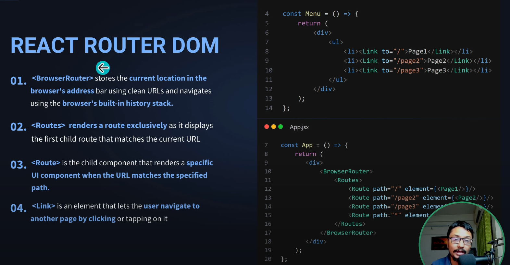

- [reactrouter](https://reactrouter.com/)
- `npm i react-router-dom`
- এক পেজ থেকে অন্য পেজে যেতে react-router-dom ব্যবহার হয়ে থাকে।
- ব্যবহার এর নিয়ম

  - `main.jsx` এর মধ্যে `<app/> কে BrowserRouter` টেগ এর মধ্যে দিতে হবে
  - `import { BrowserRouter } from "react-router-dom"; ` ইম্পোর্ট করতে হবে
  - `<BrowserRouter> <App /> </BrowserRouter>`

- Diffrent Type Router
  - [x] BrouserRouter

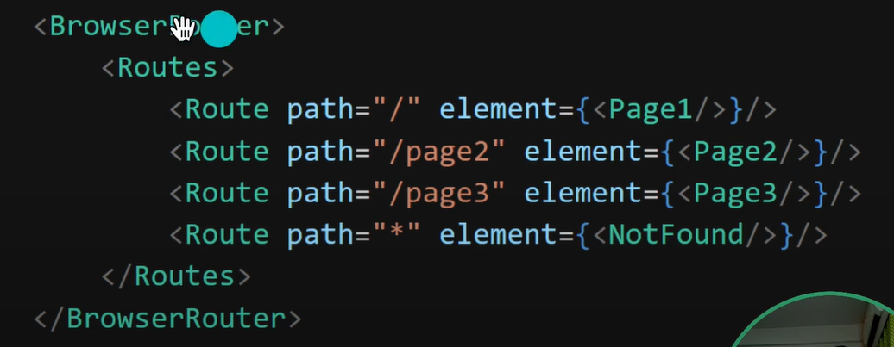

### ✨ BrowserRouter

- `<browserRouter>` -- Parent |> wrap in app.jsx IN main.jsx
- `<Routes>` -- child
- `<Route>` -- innerchild

- path="\*" => 404 Not Found

```jsx

📝 প্রথমে src তে একটা page নামে ফোল্ডার খুলে সেইটায় কয়েকটা ফাইল খুলবো এবং সেইগুলো app.jsx এ লিঙ্ক করবো।
import { BrowserRouter, Route, Routes } from "react-router-dom";
import HomePage from "./pages/HomePage";
import NotFound from "./pages/NotFound";
import ProductPage from "./pages/ProductPage";
import ProfilePage from "./pages/ProfilePage";

<BrowserRouter>
  <Routes>
    <Route path="/" element={<HomePage />}></Route>
    <Route path="/product" element={<ProductPage />}></Route>
    <Route path="/profile" element={<ProfilePage />}></Route>
    <Route path="*" element={<NotFound />}></Route>
  </Routes>
</BrowserRouter>
```

`

## ✨ Link - NavLink

- link & navlink দিয়ে পেজ লিংক করানো যায়।
- app.jsx এর মধ্যে BrowserRouter দিয়ে প্রথমে লিঙ্ক করাতে হবে।
- `import { Link } from "react-router-dom"`
- Link ব্যবহার করলে পেজ রিলোড নেয় না।

---

##### Craete a NavBar

```jsx
// 🗃️ 1️⃣  main.jsx
import { BrowserRouter } from "react-router-dom";
<BrowserRouter>
  <App />
</BrowserRouter>;
```

```jsx
// 🗃️ 2️⃣  app.jsx
import Home from "./assets/Pages/Home"; //pages
import About from "./assets/Pages/About"; //pages
import Product from "./assets/Pages/Product"; //pages
import Contact from "./assets/Pages/Contact"; //pages
import HeadersNav from "./assets/Components/HeadersNav";
import { Route, Routes } from "react-router-dom";

<div>
  <HeadersNav />
  <Routes>
    <Route path="/" element={<Home />} />
    <Route path="/about" element={<About />} />
    <Route path="/product" element={<Product />} />
    <Route path="/contact" element={<Contact />} />
  </Routes>
</div>;
```

```jsx
// 🗃️ 3️⃣  HeadersNav.jsx
import { Link } from "react-router-dom";
<div>
  <div className="container mx-auto py-5 bg-emerald-500 px-5 text-white">
    <div className="nav flex justify-between align-items-center">
      <div className="nav font-bold ">
        <Link to="/">Learn React</Link>
      </div>
      <div className="menu flex gap-5 font-bold">
        <Link to={"/"}>Home</Link>
        <Link to={"/about"}>About</Link>
        <Link to={"/product"}>Product</Link>
        <Link to={"/contact"}>Contact</Link>
      </div>
    </div>
  </div>
</div>;
```

```jsx
// 🗃️ 4️⃣ pages_text
<div className="container mx-auto text-center my-9">
  <h1>Pages</h1>
</div>
```

---

```jsx
📂 componets -> Menu.jsx
📂 Linke all pages <Menu/>

import React from "react";
import { Link } from "react-router-dom";

const Menu = () => {
  return (
    <div>
      <h1>This is menu</h1>
      <ul>
        <li>
          <Link to="/">Home</Link>
        </li>
        <li>
          <Link to="/product">Product</Link>
        </li>
        <li>
          <Link to="/profile">Profile</Link>
        </li>
      </ul>
    </div>
  );
};

export default Menu;
```

## ✨ NavLink

- NavLink ব্যবহার করে Css কন্ডিশন দেওয়া যায়।
- 📂 app.jsx এর মধ্যে BrowserRouter দিয়ে প্রথমে লিঙ্ক করাতে হবে।
- 📂 src -> assets -> css => style.css এর মধ্যে স্টাইল লিখেতে হবে
- main.jsx এর মধ্যে Import করতে হবে css
- `import { NavLink } from "react-router-dom"` In NavLinkFile

```jsx
import React from "react";
import { NavLink } from "react-router-dom";

const Menu = () => {
  return (
    <div>
      <h1>This is menu</h1>
      <ul>
        <li>
          <NavLink
            className={({ isActive }) =>
              isActive ? "active-item" : "pending-item"
            }
            to="/"
          >
            Home
          </NavLink>
        </li>
        <li>
          <NavLink
            className={({ isActive }) =>
              isActive ? "active-item" : "pending-item "
            }
            to="/product"
          >
            Product
          </NavLink>
        </li>
        <li>
          <NavLink
            className={({ isActive }) =>
              isActive ? "active-item" : "pending-item "
            }
            to="/profile"
          >
            Profile
          </NavLink>
        </li>
      </ul>
    </div>
  );
};

export default Menu;
```

### ✨ HashRouter

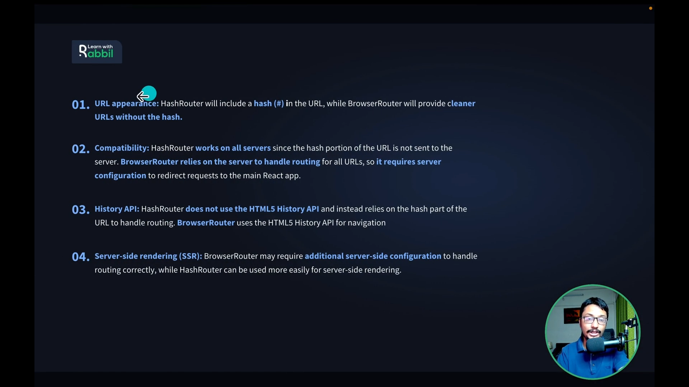

- HashRouter ব্যবহার করলে URL এর মধ্যে # আসবে।
- Compatibility : .htaccess / web.config

  - .htaccess file for react dom

- history api :- Html5 HistoryAPI
  - Navigation Method নিয়ে কাজ করে।
  - BrouserRouter এইটা ব্যবহার করে
  - HashRouter এইটা ব্যবহার করে না।

## ✨ React Router DOM Passing Parameter


## State Management -> Context API

- Centaraized Data
- 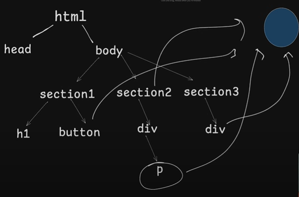

### 📝 Some Notes

- npx create-react-app "FileName" দিয়ে প্রোজেক্ট বানালে React Script থাকে সেইটা HTML এর সাথে Javascript Link করে থাকে।

- vite দিয়ে প্রোজেক্ট তেরি করে ফাইল করার সময় ফাইলের নাম আপারকেস দিতে হবে।

## 🚀 LEARN MORE

---

### 🚀 Add CSS in React

#### ✨ 1️⃣ `Add Style IN React`

- প্রথমে assets / css / style.css ফাইল নিতে হবে
- এবার এইটা main.jsx এ ইম্পোর্ট করে দিতে হবে
- `import "./assets/css/style.css";`

---

#### ✨ 2️⃣ `Install Bootsrap IN React`

- npm i bootstrap@5.3.3

```jsx
  🗃️app.jsx
  import "bootstrap/dist/css/bootstrap.min.css";
  import "bootstrap/dist/js/bootstrap.bundle.js";
```

---

#### ✨ 2️⃣ `Install Tailwind IN React`

- [Install Process Tailwind](https://tailwindcss.com/docs/guides/vite)
- npm install -D tailwindcss postcss autoprefixer
- npx tailwindcss init -p

- add This Text in tailwind.config.js

```css
/** @type {import('tailwindcss').Config} */
export default {
  content: [
    "./index.html",
    "./src/**/*.{js,ts,jsx,tsx}",
  ],
  theme: {
    extend: {},
  },
  plugins: [],
}
```

```css
  style.css
@tailwind base;
@tailwind components;
@tailwind utilities;
```

---

### ✨ Intregate API

- Tools use -> [axious](https://axios-http.com/docs/intro)
- axios api কে কল করতে সাহাজ্য করে থাকে
- `npm i axios`
- import axios from "axios";

```jsx
// 🔴 Design Card & get Data from API
// Link file with 🗃️app.jsx

import axios from "axios";
import React, { useState } from "react";

const P_Api = () => {
  const [data, setData] = useState([]);
  const getData = async () => {
    const response = await axios.get(
      "https://picsum.photos/v2/list?page=2&limit=5"
    );
    setData(response.data);
    console.log(response.data);
  };
  return (
    <div>
      <div className="m-8">
        <button
          onClick={getData}
          className="w-80 bg-emerald-500 text-white text-2xl font-bold active:scale-90 py-4 rounded"
        >
          Get Data
        </button>
        <div className="bg-gray-900 my-5 p-2 flex flex-wrap">
          {data.map(function (e, id) {
            return (
              <div key={id} className="m-3 bg-white p-5 rounded w-96">
                
                <h1 className="font-semibold">ID : {e.id}</h1>
                <h1 className="font-semibold">Author : {e.author}</h1>
                <h1 className="font-semibold">Url : {e.url}</h1>
              </div>
            );
          })}
        </div>
      </div>
    </div>
  );
};

export default P_Api;
```

---

#### ✨ Image Add in React

```jsx
import images from "../assets/img/img1.jpg";
;
```

```jsx
const img1 = require('../assets/img/img1.jpg') -> Avobe Return
;
```

```jsx
-> Its work if Image is Public Foler
;
```

---

# MORE IN REACT

### 🪼 How React Works

```js
function customRender(reElment, container) {
  const createDom = document.createElement(reElment.type);

  createDom.innerHTML = reElment.children;
  createDom.setAttribute("href", reElment.props.href);
  createDom.setAttribute("target", reElment.props.target);

  container.append(createDom);
}
const reactElement = {
  type: "a",
  props: {
    href: "https://google.com",
    target: "_blank",
  },
  children: "Click Me to Visit Google",
};

const mainCOntainer = document.querySelector("#root");

customRender(reactElement, mainCOntainer);
```

```js
function renderReacts(ReElement, container) {
  // -> Create Element
  const createElements = document.createElement(ReElement.type);

  // -> Add Element
  createElements.textContent = ReElement.children;

  // -> Check Props in Element
  for (const prop in ReElement.props) {
    if (prop === "children") continue;
    createElements.setAttribute(prop, ReElement.props[prop]);
  }

  // -> Appen Element Element
  container.appendChild(createElements);
}

const customReactElement = {
  type: "a",
  props: {
    href: "https://www.google.com",
    target: "_blank",
  },

  children: "Link From Custom React",
};
const mains = document.querySelector("#root");

renderReacts(customReactElement, mains);
```

### 🪼 Use self Function in main.jsx

- নিজের মত করে ফাংশন তেরি করে ব্যবহার করা যায় - notRecomened
- HTML Convert করতে বান্ডেলার ব্যবহার হয়। যা [vite] ব্যবহার করে।

```jsx
import { createRoot } from "react-dom/client";
// -> Create Method like app.jsx
function MyApp() {
  return (
    <div>
      <h1>Custom APP!</h1>
    </div>
  );
}

createRoot(document.getElementById("root"))
  .render
  // <MyApp />
  // MyApp()
  ();
```

```jsx
import { createRoot } from "react-dom/client";

const anotherApp = <a href="#">Hello World</a>;

createRoot(document.getElementById("root")).render(anotherApp);
```

```jsx
import React from "react";
import { createRoot } from "react-dom/client";
import App from "./App.jsx";

const userNameVariable = " ! Shanto";
const reactElement = React.createElement(
  "a", // -> Eleemnt
  { href: "GOOGLE.com", target: "_blank" }, // -> attribute
  "HELLO WORLD From React Element", // -> Children
  userNameVariable // -> Evaluate Expretion / Variable
);

createRoot(document.getElementById("root")).render(reactElement);
```

---

## More JSX

---

## ✨ React virtual DOM / Fibre / reconciliation

- https://namansaxena-official.medium.com/react-virtual-dom-reconciliation-and-fiber-reconciler-cd33ceb0478e
- createRoot :- DOM Create করে ।
- মেইন DOM এর সাথে virtual DOM কোম্পেয়ার করে এবং ইউআই তে পরিবর্তন করে।
- কিছু চেঞ্জ করলে, দেখে ট্রি স্ট্রাকচার এ যে কোথায় চেঞ্জ হয়েছে সেইটুকুই পরিবর্তন করে। এবং পেজ লোড নেয়না - এইটা virtual DOM

#### React Fiber

- https://github.com/acdlite/react-fiber-architecture
- key features include the ability to pause, abort, or reuse work as new updates come in; the ability to assign priority to different types of updates; and new concurrency primitives.
- pause work and come back to it later.
- assign priority to different types of work.
- reuse previously completed work.
- abort work if it's no longer needed.

- `***fiber Core Arctechtaer***`
- https://blog.logrocket.com/deep-dive-react-fiber/

#### reconciliation

- Browser Dom & Vartial DOm এর মধ্যে Compare করে কাকে চেক করবে এবং কাজে চেঞ্জ করবে সেইটা নির্ধারন করে এমন একটা algorithom

## Interview Question

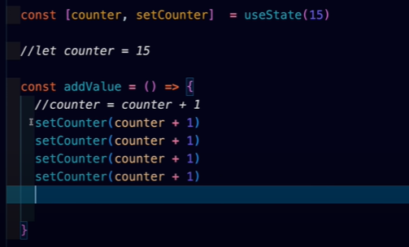

```jsx
import React, { useState } from "react";

const App = () => {
  let [counter, setCouter] = useState(0);

  const addValue = () => {
    setCounter(counter + 1);
    setCounter(counter + 1);
    setCounter(counter + 1);
    setCounter(counter + 1);
  };

  const removeValue = () => {
    setCounter(counter - 1);
  };

  return (
    <div>
      <h1>Lest Run Hooks</h1>
      <div>
        <h2>Counter Value : {counter}</h2>
        <button onClick={addValue}>Add Value</button>
        <button onClick={removeValue}>Remove Value</button>
      </div>
    </div>
  );
};

export default App;
```

- এইখানে Question হচ্ছে ৪ বার setCounter দেওয়ার ফলে কি হবে ?

- ✅ useState ডাটা একাবারে ব্রাঞ্চ হিসেবে পাঠায়, এর জন্য ৪ বার setCounter দেওয়ার ফলে একবারই আপডেট হবে।

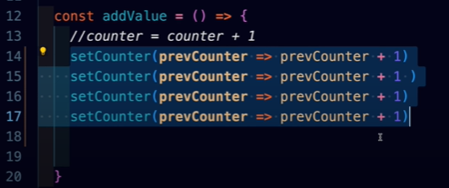

- ৪ বার বা করে আপডেট করতে হলে setCounter এর মধ্যে কলবেক ফাংশন পাস করতে হবে।

```jsx
import React, { useState } from "react";

const App = () => {
  let [counter, setCouter] = useState(0);

  const addValue = () => {
    setCounter((Prevcounter) => Prevcounter + 1);
    setCounter((Prevcounter) => Prevcounter + 1);
    setCounter((Prevcounter) => Prevcounter + 1);
    setCounter((Prevcounter) => Prevcounter + 1);
  };

  const removeValue = () => {
    setCounter(counter - 1);
  };

  return (
    <div>
      <h1>Lest Run Hooks</h1>
      <div>
        <h2>Counter Value : {counter}</h2>
        <button onClick={addValue}>Add Value</button>
        <button onClick={removeValue}>Remove Value</button>
      </div>
    </div>
  );
};

export default App;
```
