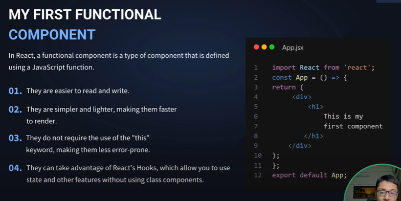

# Learning React

---

> এখানে React যা যা শিখবো নোট করে রাখবো

---

### Some Links:

[React Official Doc](https://react.dev/)
[Vite](https://vitejs.dev/guide/)

---

## 📝 NOTE START

✨ Learn First From Document
👉 For Web Devlopment :- React DOM
👉 For App Devlopment :- React Native

- What is Recat js
  - js libraray & build Front end, building UI
  - React component based Architecture :- একটা ওয়েব পেজে তেরির জন্য ছোট ছোট অনেক কম্পোনেন্ট থাকে, এবং সেই কম্পোনেন্ট গুলো একত্রে এইটি ওয়েব সাইট বানানো হয়।

---

#### React Install Process

- File Path এর মধ্যে কোন & থাকলে ফাইল রান করবে না।

* 1️⃣ Terminal -> npx create-react-app "FileName" ❌!Recomended
* 2️⃣ Install With Vite

  - 2️⃣ Vite is asset Bundling & give
  - 2️⃣ Modules with depenencies -> Static Assets

  - npm create vite@latest
  - y
  - FOlder Name
  - React
  - JavaScript
  - Done Install React
  - cd "folderName"
  - এখানে node_module আসেনা তাই ইন্সটল করতে হবে - 👉 > npm i - npm install -g vite [SomeTimeNeed]

    - ### Run Project using Vite
    - 👉 > npm run dev
    - OR
    - 👉 > vite-project@0.0.0 dev
    - 👉 > vite
    - 👉 > vite dev

    - ### Add build[dist] folder
    - 👉 > npm run build
    - 👉 > npx vite build

      ### 🫧 Clean File

          - Recomend Edit Readme FIle
          - Most Of Time Using src
          - Delete assets file
          - only Have -> app.jsx & main.jsx

      ### 📁 GEt STRAT TO CREATE PROJECT

          - remove index.css & import index.css from main.jsx
          - remove app.css
          - assets -> remove svg icon

          📁src
            - pages
            - Components
            - assets
              - images
              - css - FOlder
            - app.jsx
            - main.jsx

          📁Public
            -

```js
//app.jsx
function App() {
  return <h1>Hello React Test</h1>;
}
export default App;
```

```js
//main.jsx
import { StrictMode } from "react";
import { createRoot } from "react-dom/client";
import App from "./App.jsx";

createRoot(document.getElementById("root")).render(
  <StrictMode>
    <App />
  </StrictMode>
);
```

---

- Public -> Index.html
  - spa => Single Page Application

## 📂 Project Structure

✨ Distribution -> Dist
✨ Node Modules
✨ public
✨ Source
✨ Package.json
✨ vite Config

> ### ✨ vite Config
>
> - auto genated Files
> - Update Config If need

<br>

> ### ✨ Package.json
>
> - এই ফাইলটা হচ্ছে কি কি পেকেজ ইন্সটল আছে, প্রোজেক্ট এর ডিটেইলস এইগুলো এই ফাইলে থাকে
> - dependencies এর মধ্যে যা আছে এইগুলো প্রডাক্টশন এ যাবে
> - devdependencies এর মধ্যে যা আছে এইগুলো final প্রডাক্টশন এ যাবে না এইগুলো ডেভ্লপমেন্ট এ কাজ করে সুধু।
> - npm i packageName দিয়ে যেই মডিউল গুলো ডাউনলোড করা হয় সেইটা এইখানে থাকে।

<br>

> ### ✨ index.html
>
> - spa => Single Page Application
> - html file একটাই থাকবে
> - <div id="root"></div> এইটার মধ্যে সব ফাইল গুলো থাকে

<br>

> ### ✨ .gitignore
>
> - কোন কোন ফাইল github এ pull push হবে না সেইগুলো এইখানে থাকে

<br>

> ### ✨✨ source -> src\*\*\*
>
> - এর মধ্যে কাজ করবো
> - main.jsx
>   - এইফাইলে সব ফাইল import করে রাখা থাকবে।
> - main.jsx -> app.jsx
>   - এইফাইলে মধ্যে main action গুলো নিবে।

<br>

> ### ✨ node Module
>
> - এর মধ্যে সব Module থাকবে
> - npm i দিলে Package.json এ থাকে মডিউল/ ডিপেন্ডেঞ্ছি গুলো এইখানে চলে আসবে।

<br>

> ### ✨ dist = Build
>
> - npm run build
> - npx vite build
> - dist -> assets এর মধ্যে

---

---

## Functional COmponents

## 

- view output Return করে।

```jsx
const App = () => {
  return <div></div>;
};

export default App;
```

- vs code -> rsc to create this
- App এর করান আমরা app.jsx ফাইলে কাজ করছি
- return এর মধ্যে যা আছে এইগুলোকে বলে রেন্ডারিং
- Server Side Rendaring - server computer / server | CSI
- Client Side Rendaring - Browser Rendaring

#### Component app.jsx এর মধ্যে এড করা নিয়ম।

- Craete a jsx file in Component folder
- import This jsx file in app.jsx

```jsx
// Demo.jsx
const Demo = () => {
  return (
    <div>
      <h1>Im DEMO Functional Component</h1>
    </div>
  );
};

export default Demo;
```

```jsx
// app.jsx
import Demo from "./demo";

const App = () => {
  return (
    <div>
      <Demo />
    </div>
  );
};
```

```jsx
// app.jsx
import Footer from "./components/Footer";
import Header from "./components/Header";
import Hero from "./components/Hero";
import From from "./components/From";

const App = () => {
  return (
    <div>
      <Header />
      <Hero />
      <From />
      <Footer />
    </div>
  );
};
```

## jsx


- jsx & Html looks same but have some diffrests in syntext
- jsx => jsx javascript XML
- HTML কোড এলাউ করে javascript কোডে
- JSX ফাইলের মধ্যে HTML কোড এর মধ্যে javascript কোড লেখা যায় `<h1>{2+2}</h1>`

#### JSX Conventions


##### ✨ Return Signle Parent element in jsx

- প্রথমে অপেনিং এন্ড ক্লোজিং টেগ থাকবে যেমনঃ

  - `<div></div>`
  - `<>  </>`
  - `import {Fragment } from "react"`
  - `<Fragment></Fragment>`

```jsx
import { Fragment } from "react";

function App() {
  return (

    <div>
      <h1>Hello</h1>
      <h1>{2 + 2}</h1>
    </div>

    <>
      <h1>Hello World</h1>
    </>

    <Fragment>
      <h1>Hello World</h1>
    </Fragment>
  );
}

export default App;
```

##### ✨ Implement Javascript Directly in jsx

- jsx এর মধ্যে javascript লেখা যায়
- `<h1>{2+2}</h1>`
- {ব্রেকেট} দিয়ে ব্লক এর মধ্যে লিখেতে হবে

```js
import { Fragment } from "react";

function App() {
  return (
    <Fragment>
      <h1>Hello World</h1>
      <h2>{new Date().getHours()}</h2>
      <h2>{new Date().getMinutes()}</h2>
    </Fragment>
  );
}

export default App;
```

##### ✨ need to close all tag - self Close in jsx

- ``
- `<p />`
- `<h1 />`

##### ✨ Jsx className

- jsx এ ক্লাস নিতে গেলে লিখতে হবে className="heading"

```jsx
function App() {
  return (
    <div>
      <h1 className="heading">Hello In Css Class</h1>
    </div>
  );
}

export default App;
```

##### ✨ all HTML attributes in camelCase in Jsx

- Jsx এর attributes গুলো কেমেল্কেস হবে।

```jsx
function App() {
  return (
    <div>
      <button onClick={() => alert("Hello")}>Submit</button>
      <button onSubmit="">Submit</button>
    </div>
  );
}

export default App;
```

##### ✨ inline css Styles in objects

- style={{style in object}}
- style={{ color: "red",fontSize: "36px",}}

```jsx
function App() {
  return (
    <div>
      <button style={{ color: "red", fontSize: "36px" }}>SUbmit</button>
    </div>
  );
}

export default App;
```

---

## Jsx Ternary Operator

##### ✨ Inline if else

```jsx
function App() {
  let marks = 80;
  return (
    <div>
      {marks > 80 ? <h1>Brilliant Result</h1> : <h1>Avarage Result</h1>}
    </div>
  );
}

export default App;
```

##### ✨ jsx immediately-invoked

- immediately-invoked function Create করার সাথে সাথে কল করা যায়।

```jsx
  <div>
  {(
    ()=>{
      return `text`;
    }
  ),()}
  </div>

  -----------------
import Condition from "./moreLearn/Condition";
import IIFF from "./moreLearn/IIFF";

function App() {
  return (
    <div>
      <Condition />
      <IIFF />
    </div>
  );
}

export default App;


  const IIFF = () => {
  let marks = 90;
  return (
    <div>
      {(() => {
        if (marks > 80 && marks < 100) {
          return <h1>You get A+</h1>;
        }
      })()}
    </div>
  );
};
```

---

### Jsx Loop

- Map Use হয়ে থাকে।

```jsx
const Loop = () => {
  const city = ["Dhaka", "New York", "Dilhi"];
  return (
    <div>
      <h1>Loop In Js</h1>
      <ul>
        {city.map((item, i) => {
          return <li key={i.toString()}>{item}</li>;
        })}
      </ul>
    </div>
  );
};

export default Loop;
```


- Return করার ক্ষমতা রাখে।
- [MORE LOOPS](https://www.telerik.com/blogs/beginners-guide-loops-in-react-jsx)

---

### Jsx Conditional Rendering

- Case: ইউজার যখন Login Button এ ক্লিক করবে তখন তাকে logout বাটন সো করাতে হবে এইটা হচ্ছে Conditional Rendering
- if... else
- Switch
- Ternary Operator
- Logical &&
- IIFF

##### ✨ If ... Else Condition

```jsx
const logInStatus = (status) => {
  if (status) {
    return <button>Logout Button</button>;
  } else {
    return <button>Login Button</button>;
  }
};

const Conditional_randaring = () => {
  return (
    <div>
      <h1>Login Status</h1>
      {logInStatus(false)}
    </div>
  );
};

export default Conditional_randaring;
```

##### ✨ Switch Case Statement

```jsx
const Conditional_randaring = () => {
  const status = false;

  switch (status) {
    case true:
      return (
        <>
          <h1>Login Status</h1>
          <button>Logout</button>
        </>
      );
    case false:
      return (
        <>
          <h1>Login Status</h1>
          <button>Login</button>
        </>
      );
    default:
      return null;
  }
};

export default Conditional_randaring;
```

##### ✨ Ternary Operation

```jsx
const Conditional_randaring = () => {
  let status = false;

  return (
    <div>
      <h1>Login Status</h1>
      {status ? <button>Logout</button> : <button>Login</button>}
    </div>
  );
};

export default Conditional_randaring;
```

##### ✨ && || Operation

```jsx
const Conditional_randaring = () => {
  let status = false;

  return (
    <div>
      <h1>Login Status</h1>
      {(status && <button>Logout</button>) || <button>Login</button>}
    </div>
  );
};

export default Conditional_randaring;
```

## 👉 Props -> Properties


- এইখানে পেরেন্ট এর চাইল্ড এর ফ্লো ধরে কাজ করেতে হবে।
- যেমনঃ app.jsx হচ্ছে পেরেন Hero.jsx হচ্ছে app.jsx চাইল্ড এবং HeroImg.jsx যদি Hero.jsx এ ইম্পোর্ট করা হয় তাহলে সেইটা হচ্ছে Hero.jsx এর চাইল্ড এভাবে Uni-direction flow তে চলে।
- Props data is Read Only / Emutable -> এর মানে, পেরেন্ট Component এর ডাটা চাইল্ড ডাটা দিয়ে পরিবর্তন হবে না।- পেরেন্ট এর ডাটা চাইল্ড চেঞ্জ করতে পারবেনা,পেরেন্ট Component যেভাবে ডাটা পাঠাবে সেইভাবে চাইল্ড কে ডাটা রিসিভ করতে হবে।

```jsx

✨ app.jsx -- Parent ⬇️

import Hero from "./Components/Hero";

function App() {
  return (
    <div>
      <Hero />
    </div>
  );
}

export default App;

✨  -- app.jsx -- Parent ➡️ Hero.jsx Child ⬇️

import HeroImages from "./HeroImages";

const Hero = () => {
  return (
    <div>
      <h1>Hello Hero Section</h1>
      <HeroImages />
    </div>
  );
};

export default Hero;


✨ Hero.jsx Parent ➡️ HeroImages.jsx Child

const HeroImages = () => {
  return (
    <div>
      
    </div>
  );
};

export default HeroImages;


```

### ✨ Props String pass

```jsx
📁 App.jsx
import Hero from "./Components/Hero";

function App() {
  return (
    <div>
      {/* Learning Props */}
      <Hero title="This is React" Des="Learning React jsx Props" />
    </div>
  );
}

export default App;
```

```jsx

📁 Hero.jsx
const Hero = (props) => {
  return (
    <div>
      <h1>{props.title}</h1>
      <h1>{props.Des}</h1>
    </div>
  );
};

export default Hero;
```

- এখানে 📁 App.jsx হচ্ছে Parent এবং 📁 Hero.jsx হচ্ছে এর চাইল্ড।
- এখানে App.jsx থেকে স্ট্রিং ডাটা Hero.jsx পাঠানো হচ্ছে। এইডাটা সুধু পেরেন্ট ক্মপোনেন্ট পরিবর্তন করতে পারবে, চাইল্ড কোন পরিবরন করতে পারবেনা।

### ✨ Props Object pass

```jsx
📁 App.jsx
import Hero from "./Components/Hero";

function App() {

  const itemObj = {
    name: "Saiful Islam Shanto",
    learning: "React JSx",
    city: "Narayanganj",
  };

  return (
    <div>
      <Hero item={itemObj} />
    </div>
  );
}

export default App;

```

```jsx

📁 Hero.jsx
const Hero = (props) => {
  return (
    <div>
      <h3>Name : {props.item["name"]}</h3>
      <h3>Learning : {props.item["learning"]}</h3>
      <h3>City : {props.item["city"]}</h3>
    </div>
  );
};

export default Hero;

```

### ✨ Props Function Pass

```jsx
📁 App.jsx - Component Load এর সাথে সাথে এক্সিকিউট হয়ে যাবে
import Hero from "./Components/Hero";

function App() {
  return (
    <div>
   <button onClick={alert("Hello World")}>Click</button>
    </div>
  );
}

export default App;

```

```jsx
📁 App.jsx - arrow function inside the randaring
import Hero from "./Components/Hero";

function App() {
  return (
    <div>
   <button
        onClick={() => {
          alert("Hello World Inside With Arrow Function");
        }}
      >
        Click - Inside Button - AF
      </button>
    </div>
  );
}

export default App;

```

```jsx
📁 App.jsx - Regular function inside the randaring
import Hero from "./Components/Hero";

function App() {
  return (
    <div>
   <button
        onClick={function demo() {
          alert("Hello World Inside With Regular Function");
        }}
      >
        Click - Inside Button - RF
      </button>
    </div>
  );
}

export default App;

```

```jsx
📁 App.jsx - Regular function Outside the randaring
import Hero from "./Components/Hero";

  function showAlert() {
    alert(" HEllo World Reguler function");
  }


function App() {
  return (
    <div>
   <button onClick={showAlert}>Click</button> <br />
    </div>
  );
}

export default App;

```

```jsx
📁 App.jsx - Arrow function Outside the randaring

import Hero from "./Components/Hero";
  const showAlert2 = () => {
    alert(" HEllo World with arrow function");
  };

function App() {
  return (
    <div>
   <button onClick={showAlert2}>Click</button> <br />
    </div>
  );
}

export default App;
```

## Form Submit in jsx

- একটা ফ্রোম সাবমিট এর সময় রিলোড নেয়, কিন্তু এইটা বন্ধ করতে চাইলে form এর form এ ফাংশন পাস করতে হবে।
- preventDefault -> ডেফল্ট ইভেন্টকে বন্ধ করে দেয়।

```jsx
📁 App.jsx

import Hero from "./Components/Hero";
  const postFromData = (event) => {
    event.preventDefault();
    alert("Form Submitted");
  };

function App() {
  return (
      <div>
        <form action="#" onSubmit={postFromData}>
          <input type="text" placeholder="Name" />
          <button type="submit">submit</button>
        </form>
      </div>
  );
}
```

## ✨ React Hook

## 

- React Hook হচ্ছে, React লাইব্রেরি এর মধ্যে React hook একটি বিল্টিন ফিচার
- React hook এর মধ্যে অনেক গুলো মেথড আছে

### useRef()

- Render ছাড়া কোন ভ্যেলু চেঞ্জ করা যায়
- DOM এলিমেন্ট এ এক্সেস করা যায়।

#### How to use useRef()

- useRef ব্যবহার এর জন্য প্রথমে
  - `import { useRef } from "react";` করতে হবে
- id এর বদলে, ref ব্যবহার করতে হবে
  - `<h1 ref={headingIs}></h1>` inside Return

#### change InnerHtml & InnerText

##### ✨ Wit Current Statemnt

```jsx
📂 main file is UseRef.jsx & import this in app.jsx

import { useRef } from "react";
const UseRef = () => {
  let headingIs = useRef();
  const change = () => {
    headingIs.current.innerHTML = "<ul><li>A</li><li>B</li></ul>";
  };
  return (
    <div>
      <h2>Learn Useref</h2>
      <h1 ref={headingIs}></h1>
      <button onClick={change}> click </button>
    </div>
  );
};

export default UseRef;
```

##### ✨ Without Current Statemnt

```jsx

📂 main file is UseRef.jsx & import this in app.jsx

import { useRef } from "react";
const UseRef = () => {
  let headingIs = useRef();
  const change = () => {
    // * Without Current Statemnt
    headingIs.innerText = "Hello useRef without Current Statement";
  };
  return (
    <div>
      <h2>Learn Useref</h2>
      <h1 ref={(h1) => (headingIs = h1)}></h1>
      <button onClick={change}> click </button>
    </div>
  );
};

export default UseRef;
```

#### Use Attribute

```jsx

📂 main file is UseRef.jsx & import this in app.jsx

import { useRef } from "react";
const UseRef = () => {
  {
    /* ✨ Change Attribute Value  */
  }
  let myImg = useRef();
  const showImg = () => {
    myImg.current.src = "https://placehold.co/600x400?text=Hello+World";
    myImg.current.setAttribute("height", "200px");
    myImg.current.setAttribute("width", "300px");
  };

  return (
    <div>
      <h2>Learn Useref</h2>

      {/* ✨ Change Attribute Value  */}

      
      <button onClick={showImg}>Click</button>
    </div>
  );
};

export default UseRef;
```

#### Use In Input

```jsx
import { useRef } from "react";
const UseRef = () => {
  // For Multipale Refferance
  let firstName,
    lastName,
    Age = useRef();

  const showName = () => {
    let FName = firstName.value;
    let lName = lastName.value;
    let age = Age.value;

    alert(`First Name : ${FName} \nLast Name : ${lName} \nAge : ${age}`);
  };

  return (
    <div>
      <h2>Learn Useref</h2>
      {/* ✨ Input  */}

      <input
        ref={(a) => (firstName = a)}
        type="text"
        placeholder="First Name"
      />
      <br />
      <input ref={(b) => (lastName = b)} type="text" placeholder="Last Name" />
      <br />
      <input ref={(ageIs) => (Age = ageIs)} type="text" placeholder="Age" />
      <br />
      <button onClick={showName}>Show Name</button>
    </div>
  );
};

export default UseRef;
```

```jsx
import { useRef } from "react";
const UseRef = () => {
  {
    /* ✨ Input  */
  }
  let firstName = useRef();
  let lastName = useRef();

  const showName = () => {
    let FName = firstName.current.value;
    let lName = lastName.current.value;

    alert(`${FName} ${lName}`);
  };

  return (
    <div>
      <h2>Learn Useref</h2>

      {/* ✨ Input  */}

      <input ref={firstName} type="text" placeholder="First Name" />
      <br />
      <input ref={lastName} type="text" placeholder="Last Name" />
      <br />
    </div>
  );
};

export default UseRef;
```

#### Add & Remove - Css Class

##### ✨ Install Bootstrap In React Projects

- npm i bootstrap@5.3.3
- `import "bootstrap";`
- `import "bootstrap/dist/css/bootstrap.min.css";`
- 🚀 Lets GOOOOOOOOOOOOO

```jsx
import { useRef } from "react";
const UseRef = () => {
  let myGeadLine = useRef();
  {
    /*Change Singel Class*/
  }
  const change = () => {
    myGeadLine.current.classList.remove("text-success");
    myGeadLine.current.classList.add("text-primary");
  };

  {
    /*Change Multiple Class*/
  }
  let myHeading = useRef();
  const changeBTN = () => {
    myHeading.current.classList.remove("text-white", "bg-dark", "text-center");
    myHeading.current.classList.add("text-danger", "bg-primary", "text-left");
  };

  return (
    <div>
      <h2>Learn Useref</h2>

      {/* ✨ Css Class  */}
      <div>
        {/*Change Singel Class*/}
        <h1 className="text-success" ref={myGeadLine}>
          This is Head Line
        </h1>
        <button onClick={change}>Change Color</button>

        {/*Change Multiple Class*/}
        <h1
          className="text-white p-2 fs-5 text-center mx-4 bg-dark"
          ref={myHeading}
        >
          Hello World, Css Class add
        </h1>
        <button onClick={changeBTN}>change</button>
      </div>
    </div>
  );
};

export default UseRef;
```

#### Persisted Mutable Values

- Component এর ভিতরে কোন ভ্যেলু চেঞ্জ করলে Component ফাইল রিরেন্ডার হবেনা। রিরেন্ডার ছাড়া এক্টা ভ্যেলুকে চেঞ্জ করা হয় useRef() দিয়ে।

```jsx
import { useRef } from "react";
const UseRef = () => {
  let number = useRef(0);
  const change = () => {
    number.current++;
    console.log(number.current);
  };

  return (
    <div>
      <h2>Learn Useref</h2>
      <button onClick={change}>Increment</button>
    </div>
  );
};

export default UseRef;
```
