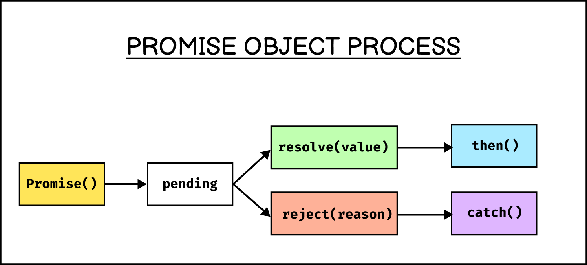

# javascript asynchronous

- ## https://www.programiz.com/javascript/setTimeout

## ✨ Sync

- একটার পরে একটা কাজ করবে, একটা কাজ শেষ হয়ে আরেকটা করবে এইটা হচ্ছে Synchronous। এখানে ওর্ডার অন্যযাই কাজ করবে।

## ✨ ASync

- একসাথে কাজ এর ওর্ডার দিয়ে দেওয়া হয় যেইটার কাজ প্রথমে হবে সেইটা প্রথমে আসবে এবং যেইটার কাজ শেষে হবে সেইটা শেষে আসবে এবং এইটা হচ্ছে ASynchronous।
- setTimeout
- setInterval
- Promise
- fetch
- axios
- XMLHttpRequest

## 😒 Stack

> `Main stack` এ কোন Sync প্রোগ্রাম থাকে এবং এইটা সাহেসাথে আউটপুট দিয়ে দেয়।

> `side stack` এ যে ASync প্রোগ্রাম থাকে সেগুলো বিহাইন্ড দা সিন এ প্রসেস হত এবং প্রসেস শেষ হলে মেইন স্টাক এ আসে।

> যখন `Main stack` খালি হয় তখন `side stack` এ চেক করে যদি ডাটা থাকে তাহলে সেইটা `Main stack` আনে এবং আউটপুট দেখায়।

> **Event Loop** `Main stack` `side stack` এর সাথে ক্মিউনেকশন করে।

```js
console.log("HEllo 1"); #MainStack - s
console.log("HEllo 2"); #MainStack -s

setTimeout(() => {
  console.log("Hello 3"); #SideStack - a
}, 2000);

console.log("HEllo 4"); #MainStack - s

setTimeout(() => {
  console.log("Hello 5"); #SideStack - a
}, 2000);


🪼 Output
HEllo 1
HEllo 2
HEllo 4
Hello 3
Hello 5
```

## Callback

- এইগুলো চলে async কোড এ

  - fetch
  - axios
  - promise
  - setTimeout
  - setinterval
  - XMLHttpRequest

- এইগুলো ব্যবহার হয়, async কোড এর রিপ্লাই বা এন্সার আসলে।

  - callback
  - then catch
  - async await

- Callback is a Function । এইটা সুধু async কোড এ কমপ্লিট হলে চলে।

## Some Notes

### ⭐ Thread

- Js Singel Thread Language - এ সাথে একটি কাজ করতে পারে।
- দুইটি কাজ একসাথে করতে পারে তাকে Js MultiThread বলে।

## Promise


https://www.freecodecamp.org/news/javascript-promise-object-explained/#heading-how-a-promise-works

-

## ⭐ Async Await

-

## ⭐ 5 UseCase in ayncronus Js

- Node
- fetch
- setTimeout
- setinterval

## ⭐ Concurrency and parallelism and Throttling

#### Concurrency

- asynchronous এবং synchronous কোড যখন একসাথে চলে তখন তাকে Concurrency বলে। যখন কোড Main Stack & Side Stack এ একসাথে থাকে। ২ কাজ একসাথে হয়।

#### parallelism

- [Concurrency and parallelism](https://blog.openreplay.com/concurrency-vs-parallelism-in-javascript/)

#### Throttling

- কোন কোড এর মধ্যে নাম্বার অফ এক্সিকিউশন কন্ট্রল করা যায়।

Concurrency , Parallelism , Throttling in js
