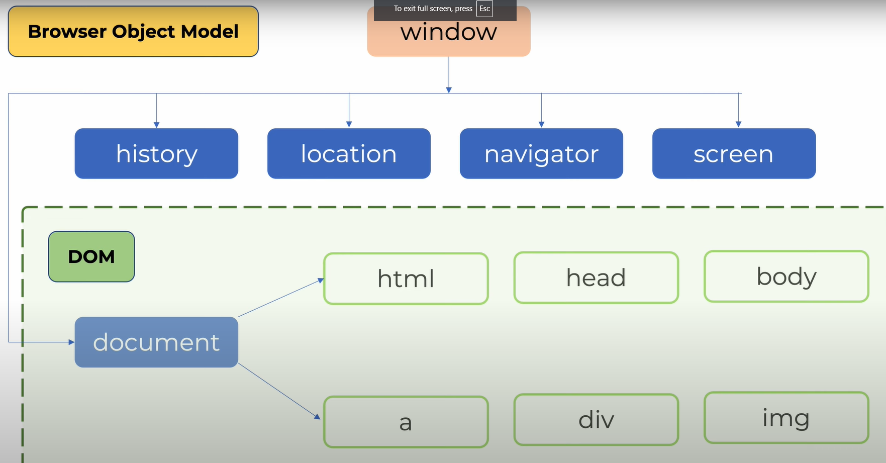

# BOM - Browser Object Modle

---

- ব্রাউজার নিয়ে কাজ করতে হলে BOM জানতে হবে।
- BOM এর মধ্যে DOM থাকে।
- BOM হচ্ছে একটি উন্ডো[window] অব্জেক
  

....

### Location

- window.location -> herf
- window.location.relode() :- এইটা পেজ রিলোড করে।
