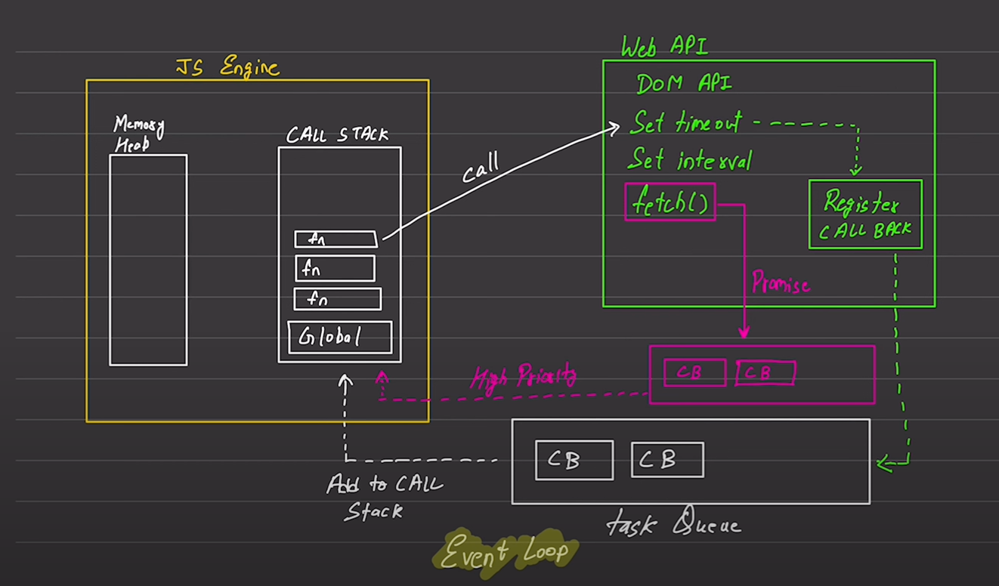

# Javascript Async

---

### javascript Default Beheviar

1. Synchronouse
   > এক লাইন এক লাইন করে কোড এক্সিকিউট হয়ে থাকে।
2. single Threaded
   > একটি থ্রেড এর মধ্যে এক্সিকিট হবে।

---

### Execution Context

> execute one line of code at time

-> console log() -> 1
-> console log() -> 2
[call Stack] [Memory Heap]

---

### Blocking Code Vs Non Blocking Code

> Blocking Code  
>
> - Block the flow of program
> - Read File Sync

 

> Non Blocking Code  
>
> - Dose not Block Execution
> - Read File Async

